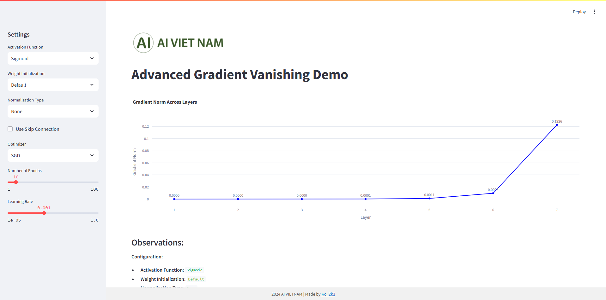
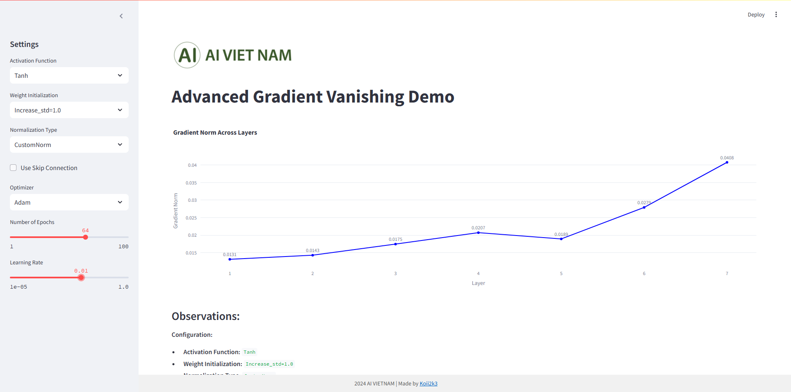

# Advanced Gradient Vanishing Demo

This project demonstrates the **vanishing gradient problem** and visualizes gradients across layers in a neural network. It uses **Streamlit** for an interactive web interface, allowing users to explore the effects of various configurations like activation functions, weight initialization, normalization, and skip connections on gradient behavior.

---

## Features

- Visualize **Gradient Norm** across layers in a deep neural network.
- Adjust model configurations via an interactive **Streamlit sidebar**:
  - Number of layers.
  - Activation functions (Sigmoid, ReLU, etc.).
  - Weight initialization (Normal, Xavier, He).
  - Normalization types (BatchNorm, LayerNorm).
  - Learning rate and optimizer (SGD, Adam).
  - Skip connection support.
- Interactive **Plotly chart** to display gradient values layer by layer.
- Detailed **observations** about the model configuration and gradient behavior.

---

## Installation

### Prerequisites
- Python >= 3.8
- pip package manager

### Install Required Libraries
Run the following command to install all necessary dependencies:
```bash
pip install -r requirements.txt
```

If you don't have the `requirements.txt` file, you can install the required libraries manually:
```bash
pip install streamlit torch plotly numpy
```

---

## Usage

### Run the Application
Start the Streamlit application by running:
```bash
streamlit run app.py
```

### Explore the Interface
1. Open your browser and navigate to the URL provided by Streamlit (e.g., `http://localhost:8501`).
2. Use the **sidebar** to configure:
   - Number of layers in the model.
   - Activation functions and weight initialization methods.
   - Normalization techniques and learning rate.
3. Observe the **gradient norms** for each layer on the interactive Plotly chart.
4. Check the **Observations** section for detailed insights about the model configuration and gradient behavior.

---

## Example Screenshots

### Interactive Interface



---

## Acknowledgments

- **Streamlit**: For providing an easy-to-use interactive interface.
- **PyTorch**: For building neural network models.
- **Plotly**: For creating interactive visualizations.
